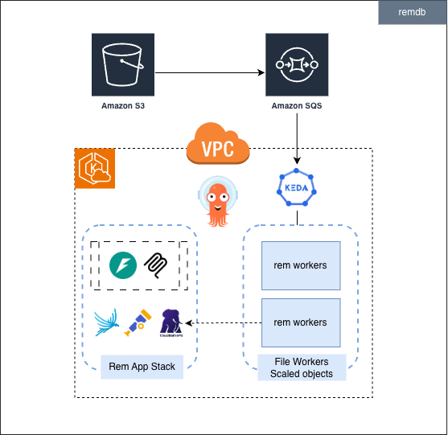
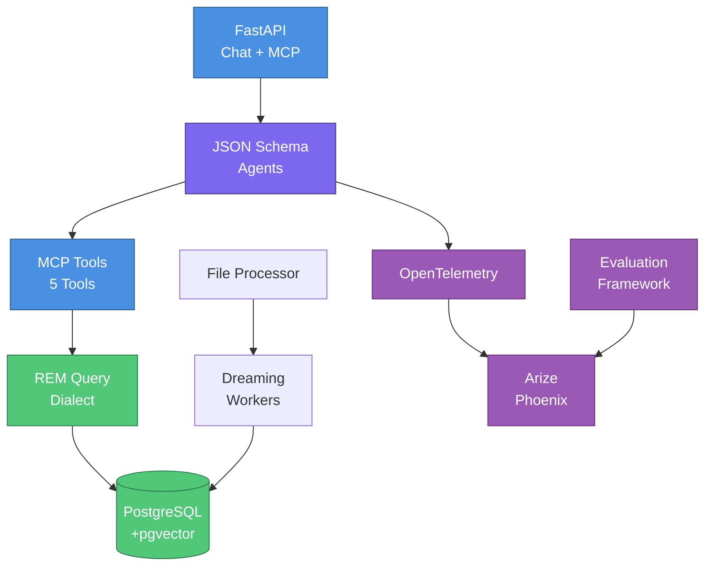

# REMStack

Cloud-native REM (Resources Entities Moments) system for agentic AI workloads on AWS EKS.

## What is REM?

REM is a **unified memory infrastructure** for AI agents that combines:
- **Multi-index database**: PostgreSQL with KV store + vector search + graph traversal + temporal queries
- **Custom query dialect**: O(1) lookups, semantic search, graph exploration with formal grammar
- **Progressive enrichment**: Background "dreaming" workers that build knowledge graphs from raw data (0% → 100% answerable)
- **No-code agents**: JSON Schema-based agent definitions with Pydantic AI runtime
- **Production-ready APIs**: OpenAI-compatible chat completions + MCP server for Claude Desktop/Cursor
- **Built-in observability**: OpenTelemetry tracing + Arize Phoenix + LLM-as-a-Judge evaluation framework

See [rem/README.md](rem/README.md) for complete Python package documentation.

## Quick Start (5 minutes)

### Option 1: PyPI Install with Example Data (Recommended)

```bash
# Install remdb
pip install remdb[all]

# Clone example datasets
git clone https://github.com/Percolation-Labs/remstack-lab.git
cd remstack-lab

# Configure REM (interactive wizard)
rem configure --install

# Start PostgreSQL
docker run -d \
  --name rem-postgres \
  -e POSTGRES_USER=rem \
  -e POSTGRES_PASSWORD=rem \
  -e POSTGRES_DB=rem \
  -p 5050:5432 \
  pgvector/pgvector:pg18

# Load quickstart dataset
rem db load --file datasets/quickstart/sample_data.yaml --user-id demo-user

# Ask questions
rem ask --user-id demo-user "What documents exist in the system?"
rem ask --user-id demo-user "Show me meetings about API design"
```

**What you get:**
- 3 users (software team)
- 3 resources (docs, notes)
- 3 moments (meetings, sessions)
- 4 messages (team chat)
- 3 agent schemas (query assistant, analyzer, reviewer)

**Next steps:** Explore [remstack-lab](https://github.com/Percolation-Labs/remstack-lab) for domain-specific datasets (recruitment, legal, enterprise) and format examples (engrams, conversations).

### Option 2: Docker Compose (All-in-One)

```bash
# Clone and start
git clone https://github.com/Percolation-Labs/remstack.git
cd remstack/rem
export ANTHROPIC_API_KEY="sk-ant-..."
docker compose up -d

# Verify it's running
curl http://localhost:8000/health
```

**Access:**
- REST API: http://localhost:8000/docs
- MCP Server: http://localhost:8000/api/v1/mcp
- PostgreSQL: `localhost:5050` (rem/rem)

See [rem/README.md](rem/README.md) for detailed installation and usage.

## Architecture

<p align="center">
  
</p>

<div align="center">



</div>

**Key Components:**

- **API Layer**: OpenAI-compatible chat completions + MCP server (mounted, not separate)
- **Agentic Framework**: JSON Schema-based agents with no-code configuration
- **Database Layer**: PostgreSQL 18 with pgvector for multi-index memory (KV + Vector + Graph)
- **REM Query Dialect**: Custom query language with O(1) lookups, semantic search, graph traversal
- **Ingestion & Dreaming**: Background workers for content extraction and progressive index enrichment (0% → 100% answerable)
- **Observability & Evals**: OpenTelemetry tracing + Arize Phoenix + LLM-as-a-Judge evaluation framework

## Example Datasets

Looking for example data to get started? Check out [**remstack-lab**](https://github.com/Percolation-Labs/remstack-lab) - a companion repository with curated datasets and experiments:

**Datasets by Domain:**
- **Quickstart**: Minimal dataset for learning REM in 5 minutes (users, resources, moments)
- **Recruitment**: CV parsing, candidate tracking, interview pipelines
- **Legal**: Contract analysis, NDA processing, risk assessment
- **Enterprise**: Team collaboration, knowledge bases, project documentation
- **Misc**: General-purpose examples and patterns

**Datasets by Format:**
- **Engrams**: Voice memos, personal reflections, meeting transcripts with timestamps
- **Documents**: Markdown, PDF, text files with structured content
- **Conversations**: Multi-turn dialogues, chat logs, support tickets
- **Files**: Binary file examples with S3 URIs and metadata

**Working from remstack-lab:**
```bash
# Clone and work from the lab directory
git clone https://github.com/Percolation-Labs/remstack-lab.git
cd remstack-lab

# Load any dataset
rem db load --file datasets/domains/recruitment/scenarios/candidate_pipeline/data.yaml --user-id your-company

# Explore and experiment
rem ask --user-id your-company "Show me candidates with Python experience"
```

## Repository Structure

```
remstack/
├── rem/                    # Python package (PyPI: remdb)
│   ├── src/rem/           # Source code
│   ├── tests/             # Integration tests
│   ├── docker-compose.yml # Local development
│   └── README.md          # Package documentation
├── manifests/             # Kubernetes deployment
│   ├── infra/            # AWS CDK EKS infrastructure
│   ├── platform/         # ArgoCD, CloudNativePG, Phoenix
│   └── application/      # REM application manifests
└── README.md             # This file
```

**Related Repositories:**
- **[remstack-lab](https://github.com/Percolation-Labs/remstack-lab)**: Example datasets and experiments (recommended for getting started)

## Documentation

- **Python Package**: [rem/README.md](rem/README.md) - Installation, CLI, API, development
- **Infrastructure**: [manifests/infra/cdk-eks/README.md](manifests/infra/cdk-eks/README.md) - EKS cluster with CDK
- **Platform**: [manifests/platform/README.md](manifests/platform/README.md) - ArgoCD, CloudNativePG, Phoenix
- **Application**: [manifests/application/README.md](manifests/application/README.md) - Kubernetes deployment
- **Database**: [rem/src/rem/services/postgres/README.md](rem/src/rem/services/postgres/README.md) - Schema, migrations, queries
- **Evaluation**: [rem/src/rem/services/phoenix/README.md](rem/src/rem/services/phoenix/README.md) - Testing and evaluation

## Development

### Local Development with Tilt (Recommended)

[Tilt](https://tilt.dev) provides a unified dashboard for local development with hot reload, logs, and task buttons.

```bash
cd rem
tilt up

# Open http://localhost:10350 for:
# - Unified logs for all services
# - One-click restart buttons
# - Task buttons: db-migrate, test-integration, db-diff, etc.
# - Service health status
# - Links to API docs, Swagger UI
```

**Services started:**
- PostgreSQL with pgvector on port 5050
- API with hot reload on port 8000
- Worker (file processor)

**Stop:** `tilt down`

See [manifests/local/README.md](manifests/local/README.md) for advanced options (MinIO, local K8s mode).

### Alternative: Docker Compose

```bash
cd rem
docker compose up --build

# View logs
docker compose logs -f api

# Run CLI commands
docker exec rem-api rem db migrate
docker exec rem-api rem ask "What is REM?"
```

### Running Tests

```bash
cd rem
pytest tests/integration/ -v -m "not llm"  # Non-LLM tests (fast)
./scripts/run_mypy.sh                       # Type checking
```

## Deployment

### Prerequisites

- AWS Account with credentials configured
- AWS CLI and kubectl installed
- Node.js and CDK CLI installed (`npm install -g aws-cdk`)
- REM CLI installed (`pip install remdb`)

### Deploy to AWS EKS

```bash
# 1. Configure CDK
cd manifests/infra/cdk-eks
cp .env.example .env
# Edit .env with your AWS account, API keys, etc.

# 2. Deploy CDK infrastructure (~20-25 min)
# Includes EKS, ArgoCD, SSM parameters
npm install
npx cdk deploy --all --profile <your-profile>

# 3. Configure kubectl
aws eks update-kubeconfig --name <cluster-name> --region us-east-1 --profile <your-profile>

# 4. Deploy ArgoCD applications
export GITHUB_REPO_URL=https://github.com/YOUR_ORG/YOUR_REPO.git
export GITHUB_PAT=ghp_...
export GITHUB_USERNAME=your-username
rem cluster apply
```

### CLI Cluster Commands

| Command | Description |
|---------|-------------|
| `rem cluster init` | Initialize config & download manifests |
| `rem cluster validate` | Validate deployment prerequisites |
| `rem cluster apply` | Deploy ArgoCD applications (platform + rem-stack) |
| `rem cluster apply --dry-run` | Preview ArgoCD deployment |
| `rem cluster setup-ssm` | Create SSM parameters (if not using CDK) |

See [manifests/README.md](manifests/README.md) for detailed deployment guide.

## Core Design Patterns

REM implements battle-tested patterns for building production AI systems. See [CLAUDE.md](CLAUDE.md) for complete pattern documentation.

### Configuration & Settings

**Nested Pydantic Settings** (`rem/src/rem/settings.py`)
- Environment variables with double underscore delimiter (`LLM__DEFAULT_MODEL`)
- Nested settings groups by domain (LLM, MCP, OTEL, Auth, Postgres, S3)
- Automatic fallback from `LLM__*_API_KEY` to unprefixed env vars for provider compatibility
- Global singleton with sensible defaults
```python
from rem.settings import settings
api_key = settings.llm.anthropic_api_key  # Reads LLM__ANTHROPIC_API_KEY or ANTHROPIC_API_KEY
```

### Agent & API Patterns

**Header to Context Mapping** (`rem/src/rem/agentic/context.py`)
- HTTP headers automatically map to AgentContext: `X-User-Id` → `context.user_id`
- Case-insensitive header lookup with backward compatibility
- Supports both HTTP (headers) and programmatic (direct instantiation) usage

**JsonSchema to Pydantic** (`rem/src/rem/agentic/providers/pydantic_ai.py`)
- Agent schemas as JSON Schema with embedded metadata
- `description` → system prompt, `properties` → Pydantic model
- Dynamic model creation enables external schema definition (versioned, shareable)

**Streaming with agent.iter()** (`rem/src/rem/api/routers/chat/streaming.py`)
- Use `agent.iter()` for complete execution (captures tool calls)
- OpenAI SSE format: `data: {json}\n\n` with `[DONE]` terminator
- Stream tool call events with `[Calling: tool_name]` markers

**Pydantic Serialization** (`rem/src/rem/agentic/serialization.py`)
- **CRITICAL**: Always serialize Pydantic models before returning from MCP tools or API endpoints
- Use `.model_dump()` or `.model_dump_json()` to prevent field loss
```python
# ✅ CORRECT
return {"response": result.output.model_dump()}

# ❌ WRONG - fields may be silently dropped
return {"response": result.output}
```

### Infrastructure Patterns

**Stateless MCP Mounting** (`rem/src/rem/api/main.py`)
- FastMCP with `stateless_http=True` for Kubernetes (prevents stale sessions across pod restarts)
- Mount at `/api/v1/mcp`, combined lifespan management

**Middleware Ordering** (`rem/src/rem/api/main.py`)
- Middleware runs in reverse order of addition
- CORS added LAST (runs FIRST) - critical for auth headers on 401/403 responses

**Conditional OTEL Instrumentation** (`rem/src/rem/settings.py`)
- OTEL disabled by default for local development
- Enable in production: `OTEL__ENABLED=true`
- Applied at agent creation: `Agent(..., instrument=settings.otel.enabled)`

### Data Patterns

**Agentic Chunking** (`rem/src/rem/utils/agentic_chunking.py`)
- Handle inputs exceeding model context windows (128K for GPT-4o, 200K for Claude)
- Smart chunking with line/word boundary preservation
- Configurable merge strategies: CONCATENATE_LIST, MERGE_JSON, LLM_MERGE
```python
from rem.utils.agentic_chunking import chunk_text, merge_results, MergeStrategy

chunks = chunk_text(large_text, max_tokens=100000, model="gpt-4o")
results = [await agent.run(chunk) for chunk in chunks]
merged = merge_results([r.output.model_dump() for r in results], strategy=MergeStrategy.CONCATENATE_LIST)
```

**Graph Edge Pattern** (`rem/src/rem/models/core/inline_edge.py`)
- Human-readable destination labels (not UUIDs): `"sarah-chen"`, `"api-design-v2"`
- Edge weights: 1.0 = primary, 0.8-0.9 = important, 0.5-0.7 = secondary
- Rich metadata in properties dict enables conversational queries

**Entity Model Pattern** (`rem/src/rem/models/entities/`)
- All entities inherit from CoreModel with system fields: `id`, `created_at`, `user_id`, `graph_edges`, `metadata`, `tags`
- Data scoping by `user_id` for complete isolation
- No duplicate system fields in child models

### Database Patterns

**Repository Pattern** (`rem/src/rem/services/postgres/repository.py`)
- Generic repository with type-safe CRUD operations
- Automatic `user_id` filtering for data isolation
```python
from rem.services.postgres.repository import Repository
from rem.models.entities import Resource

repo = Repository(Resource, "resources", db)
resources = await repo.get_by_user_id("user-123", limit=10)
```

**Service Factory Pattern** (`rem/src/rem/services/postgres/__init__.py`)
- **ALWAYS** use `get_postgres_service()` factory function
- **NEVER** instantiate `PostgresService()` directly
- Factory handles connection pooling, lifecycle management, configuration

## Design Principles

- **Lean implementation**: Stubs-first, no premature optimization
- **Strict separation**: Infrastructure / Platform / Application
- **DRY code**: Single source of truth for all configurations
- **No vendor lock-in**: Raw HTTP clients, swappable providers, open standards
- **Provider-agnostic**: Switch LLM providers, embeddings, observability backends via env vars

## Technology Stack

### Core
- **Python 3.12+**: Pydantic 2.0, FastAPI, Pydantic AI
- **Database**: PostgreSQL 18 with pgvector extension
- **MCP**: FastMCP for Model Context Protocol integration

### Infrastructure
- **Cloud**: AWS EKS (Elastic Kubernetes Service)
- **IaC**: AWS CDK (TypeScript)
- **Autoscaling**: Karpenter for intelligent node provisioning

### Platform
- **GitOps**: ArgoCD for continuous delivery
- **Database Operator**: CloudNativePG for PostgreSQL management
- **Observability**: OpenTelemetry + Arize Phoenix for LLM tracing
