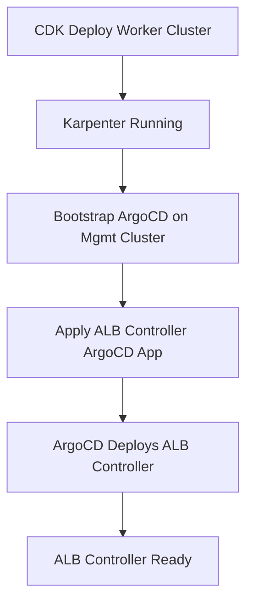

# AWS Load Balancer Controller - GitOps Deployment

This directory contains the ArgoCD Application manifest for deploying the AWS Load Balancer Controller to worker clusters.

## Architecture Decision

**Why ArgoCD instead of CDK?**

The ALB Controller is **application-layer infrastructure** (manages ingress resources), not fundamental infrastructure. Per the architectural layering:

- **CDK** = Fundamental infrastructure (cluster, Karpenter for nodes, IAM roles)
- **ArgoCD** = Application-layer components (ALB Controller, External Secrets, etc.)

This separation ensures:
1. Karpenter provisions nodes FIRST (fundamental)
2. ALB Controller manages ingress LATER (application layer)
3. No webhook timing issues

## Prerequisites

1. **Worker cluster deployed via CDK** with:
   - IAM role: `application-cluster-a-alb-controller`
   - Pod Identity association created
   - Karpenter running and healthy

2. **ArgoCD installed** on management cluster

## Deployment Workflow



### Step 1: Apply the ArgoCD Application

```bash
# From management cluster context
kubectl apply -f argocd-application.yaml
```

### Step 2: Monitor the sync

```bash
# Via ArgoCD CLI
argocd app get aws-load-balancer-controller

# Via kubectl
kubectl get application -n argocd aws-load-balancer-controller
```

## Configuration

The manifest uses hardcoded values for `application-cluster-a`:
- `clusterName`: application-cluster-a
- `region`: eu-west-1
- `vpcId`: vpc-0f1d44bc24aeffa7a

For additional clusters, create separate manifests or use Kustomize overlays.

## Verification

```bash
# Check ALB Controller pods
kubectl get pods -n kube-system -l app.kubernetes.io/name=aws-load-balancer-controller

# Check logs
kubectl logs -n kube-system -l app.kubernetes.io/name=aws-load-balancer-controller --tail=50
```

## Future: App-of-Apps Pattern

When scaling to multiple worker clusters, this will be managed by an ApplicationSet in the management cluster.
